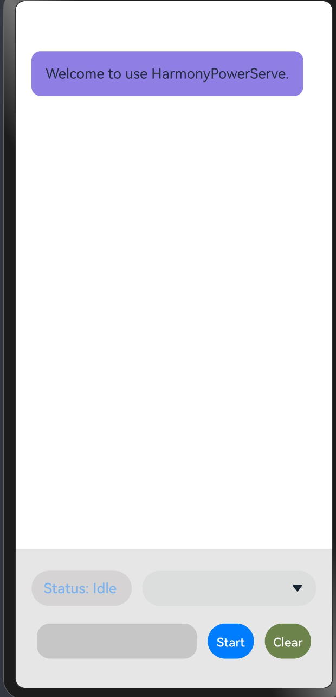

# HarmonyPowerServe

A Harmony NEXT App using PowerServe as the LLM inference backend.

## Features

- [x] Support native Harmony NEXT OS 
- [x] Support multiple-round chat
- [x] Support serving with multiple models
- [ ] Allow setting inference config
- [x] Download models automatically
- [ ] Store chat history in the database
- [ ] Allow multiple chat room with different context and chat history
- [ ] Model file consistency
- [ ] Downloading progress notification

## Build

Clone the project into local machine
```shell
git clone https://github.com/powerserve-project/HarmonyPowerServe.git
git submodule update --init --recursive
```

Download [DevEco Studio](https://developer.huawei.com/consumer/cn/programs/) and open the project.

## Usage

<div align="center">

</div>

- Select models in the selection box beside the *Status* bar
- Input your prompt
- Push the **Start** button and start your first chat!
- Push the **Clear** button to clear history message.
- To save memory, it will not record the history information. We will improve it in the future.